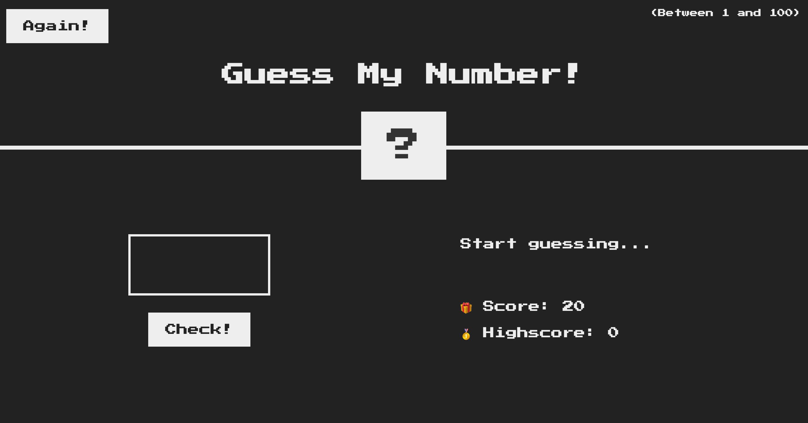

# Guess my number game

## Introduction

My Number Guessing Game is a program used to guess numbers between 1 to 100 assigned by computer AI.

## Features

1. Using Css, html and Js to display friendly user interface and interact with players
2. Let user enter guess number
3. Let user enter check if it is the right number by clicking check button or pressing enter key
4. Save and calculate Score and highscore
5. The computer automatically assigns a random number
6. Create animation by changing color and text
7. Warning players with a message
8. it is a responsive website so you can play the game on multiple devices

### You Can Try It Here: [Guess my number][1] 😎

[1]: https://guess-my-number-vod6.netlify.app/ 'Guess my number'

<!-- #### <a href="https://guess-my-number-vod6.netlify.app/" target="_blank">Hello, world!</a> -->

## Getting Started

### Installation and setup

1. you need an IDE (VS Code, Pycharm, WebStorm, ...) that is compatible with HTML, CSS and Js to be able to run this code
2. Clone this repository and import it into your IDE

### Run

#### 1. Click and run file index.html

#### 2. Enter your guess number into the empty box and click check

#### 3. The screen will turn red if you enter it wrong or don't enter any number 🤦

#### 4. You have 20 points. If you guess wrong, you will lose one point 😅

#### 5. Your highest score will be saved ✅

#### 6. You will be alerted if your guess number is too high or too low 🚨

 

#### 7. The screen will turn green if you enter it correctly 🥳

#### 8. Click Again button to guess the number again, but your highscore is still kept

## Contributing

Pull requests are welcome. For major changes, please open an issue first to discuss what you would like to change.

Please make sure to update tests as appropriate.
